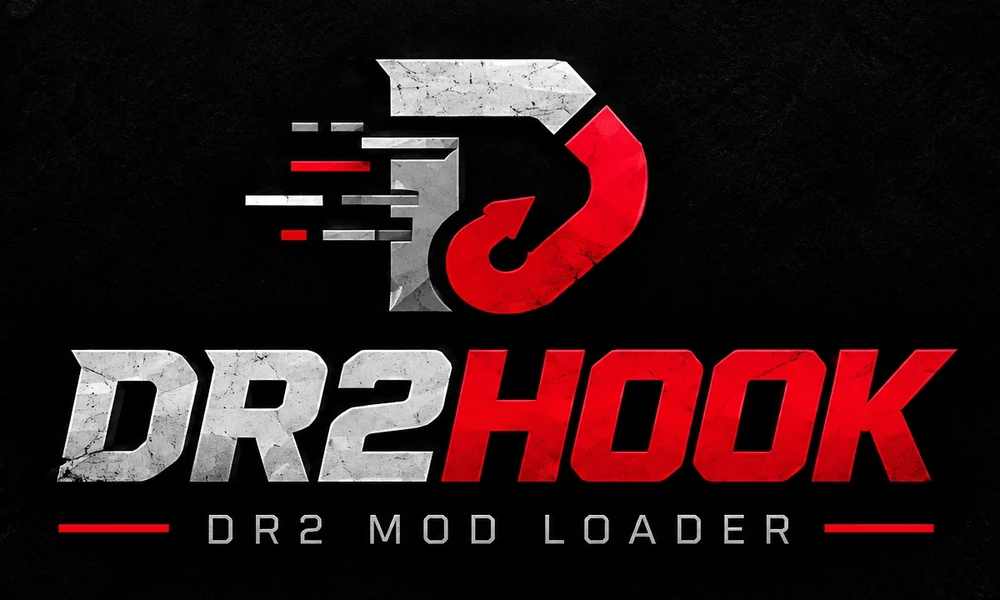
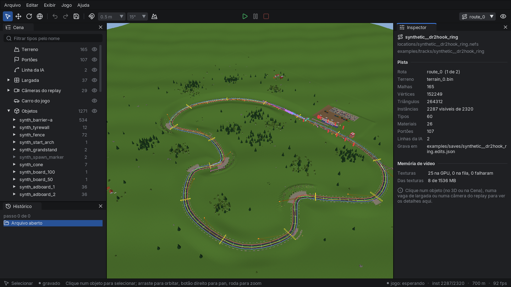
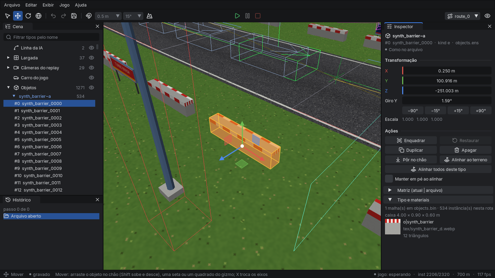
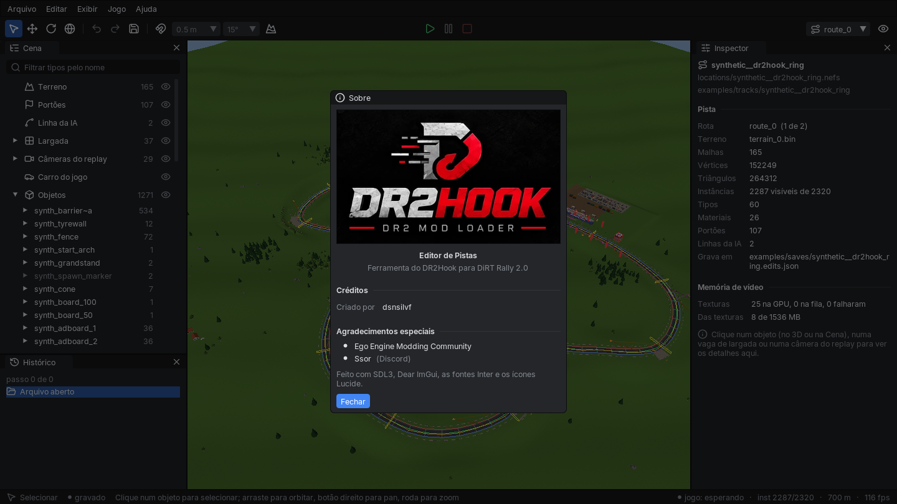

<p align="center"></p>

<p align="center">
  <b>A mod loader and toolkit for DiRT Rally 2.0</b><br>
  Lua mods, an in-game overlay and native menus, a free camera, ghost-car tools, and a track editor that can put a brand-new track into the game.
</p>

> **Work in progress.** DR2Hook is an experimental project. It has been tested only on Linux with Proton and against a single build of the game (`dirtrally2.exe` `c119f509…3442`). Expect missing pieces and crashes. It is for offline use: while it is loaded, the game cannot reach RaceNet or any server ([Online play](#online-play)).

<p align="center">
  
</p>

<p align="center">
  
  
</p>

<p align="center"><sub>The DR2Hook Track Editor with the DR2Hook Ring, a track generated from scratch that also runs in the game.</sub></p>

## What is in it

| Part | What it does |
| --- | --- |
| **Mod loader** | A `dxgi.dll` proxy that loads `dr2hook_core.dll` into the game, with no external injector. **F8** reloads the core while the game runs. |
| **Lua mods** | Lua 5.4 mods in `mods/<name>/`, with stage events (`onStageLoad`, `onCountdown`, `onStageStart`) and the `Player`, `Race`, `Ghost`, `UI` and `Menu` APIs. See the [modding guide](docs/guides/modding_guide.md). |
| **Overlay and native menus** | A Dear ImGui overlay (**Insert**), and a **DR2 Hook** entry in the game's own pause and main menus, where each mod's options appear. |
| **Practice Mode** | The example mod (`mods/practice_mode/`): checkpoints, race-start modes and ghost-car options. |
| **Free camera, ghosts, fast boot** | Free camera (**F9**). Up to 15 ghost cars plus the player. Skipping the splash screens, and a quick load that shows the loading log instead of the menus. |
| **DR2Hook Track Editor** | A native C++/OpenGL editor (`tools/viewer3d`) for stages exported from the game and for the Ring: terrain, objects, start grids, replay cameras and the AI line. You can move, rotate, duplicate and delete objects, with undo and autosave. **Testar no jogo** (F5) ports the Ring and opens the game on it. While the game runs, the editor shows where the car and the camera are. [README](tools/viewer3d/README.md) (Portuguese) |
| **DR2Hook Ring** | A made-up rallycross track built by `tools/synthtrack`: terrain, collision, ~2,300 objects, cameras, grids and a loading screen. It loads in the game through a folder overlay, with no `.nefs` changed. [examples/](examples/README.md) · [how it gets into the game](docs/reverse_engineering/track_loading.md) |
| **Browser explorers** | Car Model Explorer, Track Explorer and the game's UI screens in a local web page (`tools/uiview/`). [Docs](docs/tools/uiview.md) |
| **Reverse engineering** | Notes per subsystem (physics rig, tick order, UI, ghosts, stage loading and rendering, track formats), with every claim graded by evidence. [Index](docs/reverse_engineering/README.md) |

More in [docs/README.md](docs/README.md).

## Install

Copy `dxgi.dll`, `dr2hook_core.dll` and `mods/` next to `dirtrally2.exe`. See [install.md](docs/guides/install.md).

| Key | In the game |
| --- | --- |
| Insert | Overlay |
| F5 / F6 / F7 | Practice Mode: save a checkpoint / restore / restore with momentum |
| F8 | Reload `dr2hook_core.dll` |
| F9 | Free camera |
| F11 | Insta crash (terminal-damage research, offline only) |

## Build

The loader needs CMake 3.20+ with MinGW-w64 (from Linux) or Visual Studio 2022:

```bash
bash scripts/release/verify_release.sh      # unit tests and dist/DR2Hook-v0.1.0.zip
```

The editor needs SDL3, GLEW, GLM and libwebp:

```bash
cmake -S tools/viewer3d -B build/viewer3d -G Ninja && cmake --build build/viewer3d
./build/viewer3d/viewer3d --track examples/tracks/synthetic__dr2hook_ring
```

To run the Python tool tests: `bash scripts/dev/test_tools.sh`.

## Status

| Works | Not yet |
| --- | --- |
| Loader, F8 reload, overlay, native menus, Lua mods | `SafetyGuard` (offline-only writes) is not enforced yet |
| Practice Mode checkpoints (position and orientation) | Restoring with momentum has not been re-checked in the game |
| Free camera, up to 15 ghosts, fast boot | More than 15 ghosts crash the stage load |
| Track Editor; the Ring loads, drives and is seen in the game | The Ring has no menu entry of its own (it borrows Montalegre's package) and the player cannot drive it yet (the benchmark bot does) |
| Car and Track Explorers in the browser | Edited `.nefs` files of the original stages have not been tried in the game |

## Online play

While the loader is in the game, network traffic outside localhost is blocked, so local tools such as SimHub and UDP telemetry still work. No menu or script can turn this off. Remove the two DLLs to play online.

## Thanks

Created by **dsnsilvf**.

- **Ego Engine Modding Community** and [Ego-Engine-Modding](https://github.com/EgoEngineModding/Ego-Engine-Modding) (MIT).
- **Ssor**, for [ego-visibility-system](https://github.com/ssor0/ego-visibility-system).
- **filipe411**, for the `raceload` path tip that led to the folder overlay.
- **Paths** ([ItsNotPaths](https://github.com/ItsNotPaths)), for [DiRTbench](https://github.com/ItsNotPaths/DiRTbench) (MIT).

Not affiliated with Codemasters or Electronic Arts.

## License

[PolyForm Noncommercial 1.0.0](LICENSE). Free to use, copy, modify and share; not for commercial use. The bundled Lua (`vendor/lua/`), Dear ImGui and ImGuizmo keep their own MIT licenses.
