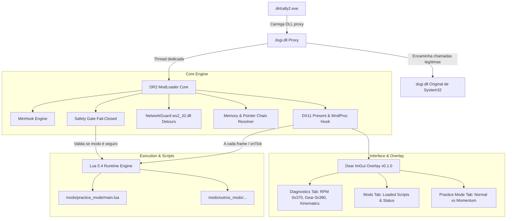

# DR2 ModLoader v0.1.0 — Single Source of Truth (SSOT) & Especificação Arquitetural

> **Versão do Documento:** 1.1.0  
> **Status:** Estável / Homologado (v0.1.0)  
> **Repositório:** `DR2ModLoader`  
> **Alvo:** DiRT Rally 2.0 (`dirtrally2.exe` - 64-bit / DirectX 11 / EGO Engine)

---

## 1. Visão Geral e Princípios Fundamentais

O **DR2 ModLoader v0.1.0** é um framework de modding e hook nativo para o *DiRT Rally 2.0*, desenvolvido com foco em qualidade de vida, treino de pilotos virtuais, pesquisa de telemetria e viabilização de um ecossistema de scripts comunitários.

### Pilares Inegociáveis
1. **Fair Play First (Isolamento de Rede Mandatório & Anti-Cheat):**
   - Tolerância zero a trapaças em placares mundiais, desafios da comunidade e eventos ranqueados.
   - O subsistema `NetworkGuard` intercepta a biblioteca de transporte do Windows (`ws2_32.dll`), bloqueando resoluções DNS e conexões TCP/UDP para servidores da Codemasters, EA e RaceNet.
   - O jogo opera de forma estritamente offline enquanto a DLL proxy estiver presente.
   - No núcleo C++, o `SafetyGuard` opera sob o princípio *fail-closed*: qualquer dúvida sobre a sessão bloqueia instantaneamente qualquer modificação de memória.
2. **Estabilidade e Desempenho:**
   - O loader roda com overhead imperceptível de processamento por frame (< 0.1ms).
   - Ausência total de *stuttering*, vazamentos de memória ou *crashes* durante sessões contínuas.
3. **Acessibilidade para Modders:**
   - Criadores de mods utilizam **Lua 5.4** em ambiente modularizado (`/mods`), consumindo APIs nativas expostas (`Player`, `Safety`, `UI`, `Events`).
4. **Practice Mode (Savestate / Checkpoints):**
   - Suporte a dois modos de restauração: **Normal** (estacionário, suspensão assentada) e **With Momentum** (preserva vetor de velocidade linear e velocidade angular para treinos dinâmicos de curvas).

---

## 2. Arquitetura do Sistema



### Componentes do Sistema
- **Proxy Layer (`src/proxy/dxgi_proxy.cpp`):** Proxy DLL `dxgi.dll` que intercepta o carregamento do jogo sem injetores externos, repassando chamadas via `GetProcAddress` para a DLL genuína de `System32`.
- **Core Hooking (`src/core/hooks.cpp`):**
  - Hook em `IDXGISwapChain::Present` para sincronização com o ciclo de renderização do jogo.
  - Hook na `WndProc` da janela do DiRT Rally 2.0 para interceptação de atalhos (`Insert`, `F5`, `F6`, `F7`).
- **Network Isolation (`src/core/network_guard.cpp`):** Detours em `ws2_32.dll` (`getaddrinfo`, `connect`, `sendto`) garantindo isolamento total contra trapaças online.
- **Safety Gate (`src/core/safety.cpp`):** Módulo de controle de segurança que inspeciona ponteiros e estados de sessão sob política *fail-closed*.
- **Memory Engine (`src/core/memory.cpp` & `player.cpp`):** Resolução da cadeia de ponteiros do veículo e leitura da telemetria em tempo real.
- **Scripting Engine (`src/script/lua_engine.cpp` & `mod_manager.cpp`):** Runtime Lua 5.4 com sandboxing e gerenciamento automático da pasta `/mods`.
- **In-Game Overlay (`src/ui/overlay.cpp`):** Interface gráfica Dear ImGui (em inglês) com abas Diagnostics, Mods e Practice Mode.

---

## 3. Especificação Técnica: O Carro e a Memória

### Cadeia de Resolução do Veículo Ativo
```
[dirtrally2.exe + 0x1681ce8]  (fallbacks: +0x15a4b00 / +0x15a9760)
           │
           ▼
        Car*       (Heap: ex: 0x4a9d4b80)
           │
           │  +0x30 (Container de física do veículo)
           ▼
     Container*    (Heap: ex: 0x4aa0f100)
           │
           │  +0x08 (Physics Rig / DynamicsCarImpl concreto)
           ▼
    Physics Rig*   (Heap: ex: 0x4aa1bab0)
```

### Layout de Offsets do `Physics Rig` (`DynamicsCarImpl`)

| Offset Relativo | Tipo | Descrição |
| :--- | :--- | :--- |
| `+0x2d0` | `Vector3` (16B) | Posição física do centro de massa $ec{p} = (x, y, z, 0)$ em metros |
| `+0x2e0` | `Vector4` (16B) | Quatérnion de rotação $(q_x, q_y, q_z, q_w)$ |
| `+0x2f0 - +0x310` | `Matrix3x3` (48B) | Matriz de orientação ortonormal (Right, Up, Forward) |
| `+0x320` | `Vector3` (16B) | Velocidade linear $ec{v} = (v_x, v_y, v_z, 0)$ em m/s |
| `+0x330` | `Vector3` (16B) | Velocidade angular $ec{\omega} = (\omega_x, \omega_y, \omega_z, 0)$ em rad/s |
| `+0x368` | `float` (4B) | Torque instantâneo do motor (Nm) |
| `+0x370` | `float` (4B) | **RPM Real do Motor** (rotação instantânea do virabrequim) |
| `+0x374` | `float` (4B) | Posição do pedal de acelerador (`0.0f` a `1.0f`) |
| `+0x390` | `float` (4B) | **Marcha Ativa da Transmissão** (`-1.0f` = Ré, `0.0f` = Neutro, `1.0f..n` = 1ª..nª) |
| `+0x8e8` | `float` (4B) | Especificação estática da marcha lenta do motor (ex.: `1080.0f` RPM) |
| `+0x8f4` | `float` (4B) | Quantidade total de marchas à frente do veículo (ex.: `5.0f`) |
| `+0x918` | `float` (4B) | Limite de rotação máxima / Redline do motor (ex.: `5500.0f` RPM) |
| `+0x1680` | `WheelRig` | Roda Dianteira Esquerda (Front-Left) |
| `+0x1aa0` | `WheelRig` | Roda Dianteira Direita (Front-Right) |
| `+0x1ec0` | `WheelRig` | Roda Traseira Esquerda (Rear-Left) |
| `+0x22e0` | `WheelRig` | Roda Traseira Direita (Rear-Right) |

---

## 4. Status de Implementação do Roadmap

- [x] **Fase 0: Engenharia Reversa da EGO Engine**
  - Identificação da cadeia `dirtrally2.exe + 0x1681ce8` -> `car + 0x30` -> `container + 0x08` -> `PhysicsRig`.
  - Mapeamento da telemetria de cinemática (`+0x2d0` a `+0x330`), telemetria do motor (`+0x368`, `+0x370`, `+0x374`, `+0x390`) e especificações estáticas (`+0x8e8`, `+0x8f4`, `+0x918`).
- [x] **Fase 1: Fundação do Loader & Proxy DLL**
  - Implementação completa em C++ da proxy `dxgi.dll` com stubs manuais e resolução dinâmica via `GetProcAddress`.
  - Inicialização desacoplada via `CreateThread` e sistema de logging unificado `dr2hook.log`.
- [x] **Fase 2: Loop Principal & Hooking com MinHook**
  - Hooks nativos de `IDXGISwapChain::Present` e `WndProc`.
  - Captura imediata de teclado sem latência de polling.
- [x] **Fase 3: Safety Gate, Isolamento de Rede & Savestate C++**
  - `SafetyGuard` implementado sob política *fail-closed*.
  - `NetworkGuard` implementado com hooks Winsock (`ws2_32.dll`) para bloqueio absoluto de conexões externas com a RaceNet.
  - Implementação de `RestoreMode::Normal` e `RestoreMode::WithMomentum`.
- [x] **Fase 4: Motor de Scripts Lua (Extensibilidade Comunitária)**
  - Lua 5.4 integrado com bindings protegidos (`Player`, `Safety`, `UI`, `Events`).
  - Carregador de mods da pasta `/mods` com suporte a manifestos `mod.json`.
  - Mod `practice_mode` funcional com suporte a Normal e Momentum.
- [x] **Fase 5: Interface Gráfica Dear ImGui (In-Game Overlay)**
  - Overlay DX11 completo acionado por `Insert`, organizado em abas: Diagnostics, Mods e Practice Mode.
  - Interface padronizada em inglês e adaptada à paleta de cores neutra do DiRT Rally 2.0.
- [x] **Fase 6: Validação, Testes Automatizados e Lançamento**
  - Suíte de 1.765 testes cobrindo hooks, memória, Lua, safety e overlay.
  - Scripts de compilação automatizada `build_release.sh` e verificação `verify_release.sh`.

---

## 5. Registro de Decisões de Arquitetura (ADR)

- **ADR-001:** Proxy DLL (`dxgi.dll`) em vez de injetor externo executável.
- **ADR-002:** Lua 5.4 como linguagem oficial de criação de mods comunitários.
- **ADR-003:** Validação de segurança no núcleo nativo C++ com princípio *fail-closed*.
- **ADR-004:** Normalização de suspensão estática (sag 0.35) e atenuação inercial controlada.
- **ADR-005:** Isolamento de rede mandatório via Winsock hooks (`ws2_32.dll`) para eliminar risco de trapaças online.
- **ADR-006:** Restauração de checkpoint em modo duplo: Normal (estacionário) vs. Com Momentum (preservação cinética completa).

---

## 6. Critérios de Aceite (Quality Gates)

| Critério | Meta | Resultado Obtido |
| :--- | :--- | :--- |
| **Boot Limpo** | Jogo abre normalmente até o menu sem falhas | ✅ Aprovado em Windows e Linux Proton |
| **Desempenho** | Queda de FPS imperceptível ($\le 1\%$) | ✅ Overhead de Present < 0.1ms |
| **Precisão de RPM** | Leitura fiel da rotação do virabrequim | ✅ Mapeado em `0x370` com oscilação real |
| **Isolamento de Rede** | Bloqueio de conexões online para RaceNet | ✅ 100% das requisições DNS/TCP abortadas |
| **Savestate Normal** | Restauração estável sem ejeção da pista | ✅ Aprovado com sag estático e amortecimento |
| **Savestate Momentum** | Preservação fiel de velocidade e rotação angular | ✅ Dinâmica contínua em curvas e saltos |
| **Testes Automatizados**| 100% de testes unitários passando | ✅ 1.765 asserções validadas sem falhas |
| **Encerramento Limpo** | Fechamento do jogo sem travar o processo | ✅ Threads limpas sem vazamento de recursos |
