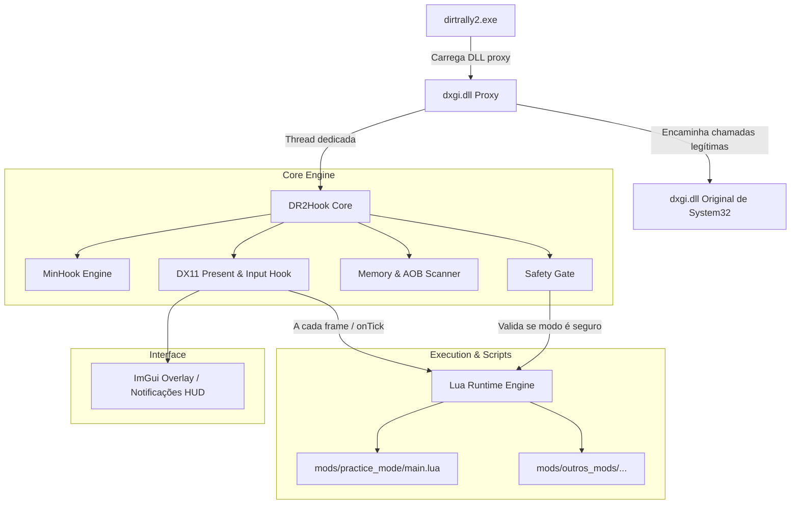

# DR2Hook — Single Source of Truth (SSOT) & Roadmap de Desenvolvimento

> **Versão do Documento:** 1.0.0  
> **Status:** Ativo / Em Desenvolvimento  
> **Repositório:** `dr2-modloader`  
> **Alvo:** DiRT Rally 2.0 (`dirtrally2.exe` - 64-bit / DirectX 11 / EGO Engine)

---

## 1. Visão Geral e Princípios Fundamentais

O **DR2Hook** é um Mod Loader leve, modular e extensível para o *DiRT Rally 2.0*, desenvolvido com foco em qualidade de vida, treino avançado de pilotos virtuais e viabilização de um ecossistema de scripts comunitários.

### Pilares Inegociáveis
1. **Fair Play First (Anti-Cheat Integrado):**
   - Tolerância zero a trapaças em placares e campeonatos ranqueados.
   - Qualquer modificação de memória que altere física, posição ou cronômetro possui **bloqueio rígido a nível de C++ (*hard-lock*)** quando uma sessão online/RaceNet for identificada.
2. **Estabilidade e Desempenho:**
   - O loader não pode causar *frame drops*, instabilidade de framerate (*stuttering*) ou falhas críticas (*crashes*) no jogo. Overhead máximo tolerado de processamento por frame: `< 0.2ms`.
3. **Acessibilidade para Modders:**
   - Criadores de mods não devem precisar reverter o jogo em assembly ou compilar C++. Uma API simples em **Lua** expõe eventos do jogo (`onStageStart`, `onTick`, `onKeyDown`) e entidades (`Player`, `Camera`, `UI`).
4. **Alvo Inicial (MVP):**
   - Entrega do **Practice Mode (Savestate / Teleporte de Treino)**, permitindo salvar (`F5`) e restaurar (`F6`) posição e velocidade do carro sem recarregar a especial.

---

## 2. Arquitetura do Sistema



### Componentes do Sistema
- **Proxy Layer (`src/proxy/`):** DLL `dxgi.dll` que intercepta o carregamento do jogo sem necessidade de injetores externos (.exe separados).
- **Core Hooking (`src/core/hooks.cpp`):**
  - Hook na função `IDXGISwapChain::Present` para sincronização de frames.
  - Hook na `WndProc` do jogo para captura limpa de teclado/volante sem atraso de polling.
- **Safety Gate (`src/core/safety.cpp`):** Módulo de controle de segurança que inspeciona ponteiros de conexão do RaceNet e flags de modo de jogo, bloqueando a escrita de variáveis críticas quando em ambiente competitivo.
- **Memory Engine (`src/core/memory.cpp`):** Localização de ponteiros via assinatura de bytes (AOB Pattern Scanning) para garantir compatibilidade com diferentes versões do jogo.
- **Scripting Engine (`src/script/`):** Runtime LuaJIT com biblioteca de bindings em C++, carregando módulos isolados a partir do diretório `/mods/`.

---

## 3. Especificação Técnica: O Carro e a Memória

### Estrutura do Jogador (`CarTransform` / `CarState`)
Para que o savestate funcione de forma fluida sem colapsar a simulação física da EGO Engine, os seguintes blocos devem ser preservados:

| Campo | Tipo | Descrição |
| :--- | :--- | :--- |
| `Position` | `Vector3` (3x `float`) | Coordenadas espaciais ($X, Y, Z$). |
| `LinearVelocity` | `Vector3` (3x `float`) | Velocidade do veículo nos eixos cartesianos ($V_x, V_y, V_z$). |
| `AngularVelocity`| `Vector3` (3x `float`) | Rotação e momento inercial angular. |
| `RotationMatrix` | `Matrix3x3` (9x `float`) ou `Quat` | Orientação tridimensional do veículo na pista. |
| `WheelStates` | Array `struct` (4 rodas) | Compressão de suspensão e contato de pneus com o piso. |

### Tabela de Permissões de Segurança (Safety Gate)

| Modo de Jogo | Leitura de Telemetria (`getPosition`) | Escrita de Estado (`setState` / Savestate) | Status no DR2Hook |
| :--- | :---: | :---: | :--- |
| **DirtFish (Área Livre)** | ✅ Permitido | ✅ Permitido | **Liberado (Treino)** |
| **Time Trial Local** | ✅ Permitido | ✅ Permitido | **Liberado (Treino)** |
| **Campeonato Custom Offline**| ✅ Permitido | ✅ Permitido | **Liberado (Treino)** |
| **Desafios Diários/Semanais** | ✅ Permitido | 🚫 **BLOQUEIO HARD-LOCK** | **Restrito (Oficial)** |
| **Clubes Oficiais Ranqueados**| ✅ Permitido | 🚫 **BLOQUEIO HARD-LOCK** | **Restrito (Oficial)** |
| **Carreira / My Team Online** | ✅ Permitido | 🚫 **BLOQUEIO HARD-LOCK** | **Restrito (Oficial)** |

---

## 4. Roadmap de Desenvolvimento por Fases

```
[Fase 0: Engenharia Reversa] ──▶ [Fase 1: DLL Proxy & Boot] ──▶ [Fase 2: Hooks MinHook/DX11]
                                                                        │
[Fase 5: Release & Testes]   ◀── [Fase 4: Lua Script Engine] ◀── [Fase 3: Safety & Savestate C++]
```

### 📍 Fase 0: Reconhecimento e Engenharia Reversa
- [ ] Conectar Cheat Engine ao `dirtrally2.exe` na pista do DirtFish.
- [ ] Localizar as coordenadas $X, Y, Z$ da posição do veículo.
- [ ] Rastrear instruções que escrevem no endereço do veículo para obter a estrutura base (`VehiclePhysics`).
- [ ] Encontrar ponteiros de velocidade linear e matriz de rotação.
- [ ] Identificar a flag ou estrutura que indica se o jogador está em menu, pausado, ou em corrida ativa.
- [ ] Mapear assinaturas de bytes (AOB) para ancoragem dinâmica.

### 📍 Fase 1: Fundação do Loader & Proxy DLL
- [ ] Criar o esqueleto do projeto gerando a DLL de saída `dxgi.dll`.
- [ ] Implementar o redirecionamento dinâmico de todas as funções exportadas pela `dxgi.dll` oficial do Windows (`C:\Windows\System32\dxgi.dll`).
- [ ] Implementar `DllMain` com inicialização assíncrona desacoplada (`CreateThread`) para não congelar o boot do jogo.
- [ ] Desenvolver sistema de logs unificado gravando em `dr2hook.log` com timestamps e níveis de severidade (`INFO`, `WARN`, `ERROR`).

### 📍 Fase 2: Loop Principal & Hooking com MinHook
- [ ] Integrar a biblioteca **MinHook** via CMake.
- [ ] Obter o endereço do `IDXGISwapChain` do DirectX 11 via criação temporária de dispositivo (*dummy device*).
- [ ] Implementar o hook de `IDXGISwapChain::Present` como loop sincronizado por frame (`onTick`).
- [ ] Fazer o hook da `WndProc` da janela do DiRT Rally 2.0 para interceptar teclas e botões de volante sem travamento.

### 📍 Fase 3: Safety Gate e Savestate Nativo (C++ MVP)
- [ ] Implementar a classe `SafetyGuard` que valida os modos de jogo e conexão RaceNet.
- [ ] Implementar rotina de teste de savestate em C++ puro:
  - Pressionar `F5`: Captura `CarTransform` e armazena em buffer de memória.
  - Pressionar `F6`: Restaura `CarTransform` verificando se o `SafetyGuard` aprova a ação.
- [ ] Adicionar amortecimento de suspensão no teleporte para evitar que o carro "quique" ou seja ejetado da pista.

### 📍 Fase 4: Motor de Scripts Lua (Extensibilidade Comunitária)
- [ ] Integrar **LuaJIT** / **sol2** (C++20 bindings).
- [ ] Criar gerenciador de módulos que escaneia e executa scripts dentro de `mods/*/main.lua`.
- [ ] Expor as classes e funções da API:
  - `Player.getPosition()`, `Player.setPosition()`
  - `Player.getVelocity()`, `Player.setVelocity()`
  - `Player.getState()`, `Player.setState()`
  - `Events.onTick(dt)`, `Events.onStageStart()`, `Events.onStagePause()`
  - `Safety.isRestrictedMode()`
- [ ] Migrar a lógica do Practice Mode para dentro de `mods/practice_mode/main.lua`.

### 📍 Fase 5: Interface Gráfica e Notificações (ImGui Overlay)
- [ ] Inicializar **Dear ImGui** dentro do hook de `Present` do DirectX 11.
- [ ] Criar sistema de notificações estilo toast na tela (ex: *"Checkpoint salvo!"*, *"Ação bloqueada pelo Fair Play em evento oficial"*).
- [ ] Menu de configurações in-game (aberto por atalho, ex: `Insert`), permitindo remapear teclas de savestate e visualizar status do mod loader.

### 📍 Fase 6: Validação, Empacotamento e Lançamento
- [ ] Testes de estabilidade em sessões prolongadas (mínimo de 1h contínua sem crashes ou vazamentos de memória).
- [ ] Testes de regressão com integridade da Steam (garantir que atualizações não corrompam o save do usuário).
- [ ] Criação de pacote de distribuição `.zip` pronto para extração na pasta do jogo com documentação clara.

---

## 5. Registro de Decisões de Arquitetura (ADR)

### ADR-001: Utilização de Proxy DLL (`dxgi.dll`) em vez de Injetor Externo (.exe)
- **Decisão:** O DR2Hook será carregado via proxy DLL `dxgi.dll` colocada na pasta raiz do executável.
- **Motivação:** Elimina atrito para o usuário (não precisa abrir outro aplicativo antes do jogo), garante injeção pré-renderização DirectX e evita falso-positivos em antivírus comuns em injetores externos via `CreateRemoteThread`.

### ADR-002: Adoção de Lua como Linguagem de Scripting para Mods
- **Decisão:** Lua (LuaJIT / sol2) foi selecionada como a linguagem oficial de criação de mods.
- **Motivação:** É extremamente leve, consome poucos recursos de CPU/RAM, não exige que os criadores compilem código binário e isola o jogo de falhas catastróficas de ponteiros nulos em código de usuário.

### ADR-003: Validação de Segurança no Núcleo Nativo (C++)
- **Decisão:** O Safety Gate é executado no Core em C++, antes de qualquer script Lua ou comando do usuário.
- **Motivação:** Impede que um mod mal-intencionado burle as verificações chamando funções de escrita de memória diretamente, protegendo a conta do jogador contra banimentos acidentais ou violações de regras do RaceNet.

---

## 6. Critérios de Aceite (Quality Gates)

| Critério | Meta | Como Testar |
| :--- | :--- | :--- |
| **Boot Limpo** | Jogo abre normalmente até o menu sem falhas | Iniciar jogo via Steam com DLL presente |
| **Desempenho** | Queda de FPS imperceptível ($\le 1\%$) | Benchmark com e sem o hook ativo |
| **Eficiência do Savestate** | Teleporte suave sem capotamento instantâneo | Testes a 50 km/h, 100 km/h e parado |
| **Eficácia Anti-Cheat** | Restauração bloqueada 100% das vezes em diárias | Tentativa de `F6` em evento online ativo |
| **Encerramento Limpo** | Fechamento do jogo sem travar o processo no Gerenciador de Tarefas | Fechar o jogo via menu ou `Alt+F4` |
