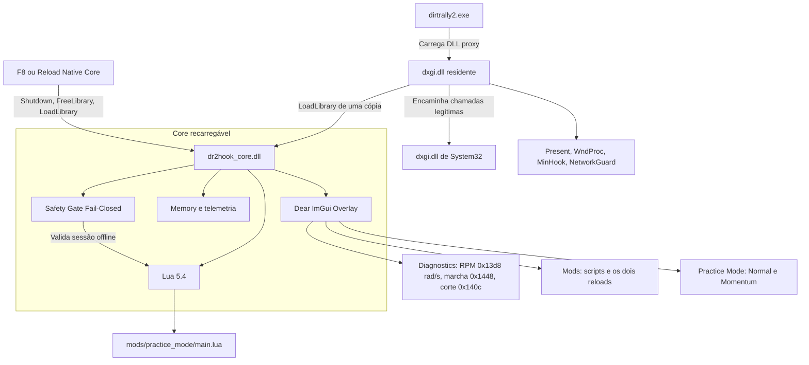

# DR2Hook v0.1.0 — Single Source of Truth (SSOT) & Especificação Arquitetural

> **Versão do Documento:** 1.2.0  
> **Status:** Estável / Homologado (v0.1.0)  
> **Repositório:** `DR2ModLoader`  
> **Alvo:** DiRT Rally 2.0 (`dirtrally2.exe` - 64-bit / DirectX 11 / EGO Engine)

---

## 1. Visão Geral e Princípios Fundamentais

O **DR2Hook v0.1.0** é um projeto de engenharia reversa do *DiRT Rally 2.0*. O mod loader descrito neste documento é a aplicação desse trabalho: hooks nativos, scripts Lua da comunidade, treino de pilotos virtuais e pesquisa de telemetria.

### Pilares Inegociáveis
1. **Fair Play First (Isolamento de Rede Mandatório & Anti-Cheat):**
   - Tolerância zero a trapaças em placares mundiais, desafios da comunidade e eventos ranqueados.
   - O subsistema `NetworkGuard` intercepta a biblioteca de transporte do Windows (`ws2_32.dll`), bloqueando resoluções DNS e conexões TCP/UDP para servidores da Codemasters, EA e RaceNet.
   - O jogo opera de forma estritamente offline enquanto a DLL proxy estiver presente.
   - No núcleo C++, o `SafetyGuard` opera sob o princípio *fail-closed*: qualquer dúvida sobre a sessão bloqueia instantaneamente qualquer modificação de memória.
2. **Estabilidade e Desempenho:**
   - O loader roda com overhead imperceptível de processamento por frame (< 0.1ms).
   - Ausência total de *stuttering*, vazamentos de memória ou *crashes* durante sessões contínuas.
3. **Acessibilidade para Modders:**
   - Criadores de mods utilizam **Lua 5.4** em ambiente modularizado (`/mods`), consumindo APIs nativas expostas (`Player`, `Safety`, `UI`, `Events`).
4. **Practice Mode (Savestate / Checkpoints):**
   - Suporte a dois modos de restauração: **Normal** (estacionário, suspensão assentada) e **With Momentum** (preserva vetor de velocidade linear e velocidade angular para treinos dinâmicos de curvas).

---

## 2. Arquitetura do Sistema



### Componentes do Sistema
- **Proxy Layer (`src/proxy/dxgi_proxy.cpp`):** Proxy DLL `dxgi.dll` que intercepta o carregamento do jogo sem injetores externos, repassando chamadas via `GetProcAddress` para a DLL genuína de `System32`. Permanece mapeada o tempo todo.
- **Host (`src/core/host.cpp`):** Carrega `dr2hook_core.dll` por `LoadLibrary` numa cópia (`dr2hook_core.N.dll`) para o arquivo original poder ser substituído. `F8` faz shutdown, `FreeLibrary` e carrega a cópia nova.
- **Core Hooking (`src/core/hooks.cpp`):**
  - Hook em `IDXGISwapChain::Present` para sincronização com o ciclo de renderização do jogo. O detour fica na `dxgi.dll` e chama o core.
  - Hook na `WndProc` da janela do DiRT Rally 2.0 para interceptação de atalhos (`Insert`, `F5`, `F6`, `F7`, `F8`).
- **Core recarregável (`src/core/core_module.cpp`):** Overlay, telemetria, savestate e mods. É o que o `F8` troca.
- **Ciclo de vida da especial (`src/core/race_events.cpp`, `src/core/load_trace.cpp`, na `dxgi.dll`):** `onStageLoad` (abertura do `.nefs` da localidade), `onCountdown` e `onStageStart` (hook de `RaceSession::OnNamedEvent`). Os eventos vão para uma fila que o core consome a cada frame (`Dr2Host_StageConsumeEvent`) e despacha ao Lua na thread de render.
- **AutoStage (`src/core/auto_stage.cpp`, na `dxgi.dll`):** força o modo benchmark nativo; instalado no `DllMain` porque o jogo o inicializa no começo do `WinMain`.
- **Largada (`src/core/cutscene_probe.cpp`, no core):** modos de largada (`Race.setStartMode`) e log dos keyframes de cutscene. Exceção consciente ao ADR-007: hooks em experimentação ficam no core para iterar com `F8`; o `Shutdown` desliga os hooks, espera as chamadas em andamento e devolve os valores do jogo que alterou.
- **Network Isolation (dentro de `src/core/hooks.cpp`, na `dxgi.dll`):** Detours em `ws2_32.dll` (`getaddrinfo`, `GetAddrInfoW`, `connect`). Nomes que não sejam localhost e conexões fora de `127.0.0.0/8` e do loopback IPv6 são recusados. `sendto` não é interceptado, então telemetria UDP local continua possível. O isolamento não vai para o módulo recarregável: um `F8` não o desliga.
- **Safety Gate (`src/core/safety.cpp`):** Módulo de controle de segurança que inspeciona ponteiros e estados de sessão sob política *fail-closed*.
- **Memory Engine (`src/core/memory.cpp` & `player.cpp`):** Resolução da cadeia de ponteiros do veículo e leitura da telemetria em tempo real.
- **Scripting Engine (`src/script/lua_engine.cpp` & `mod_manager.cpp`):** Runtime Lua 5.4 com sandboxing e gerenciamento automático da pasta `/mods`.
- **In-Game Overlay (`src/ui/overlay.cpp`):** Interface gráfica Dear ImGui (em inglês) com abas Diagnostics, Mods e Practice Mode.

---

## 3. Especificação Técnica: O Carro e a Memória

### Cadeia de Resolução do Veículo Ativo
```
[dirtrally2.exe + 0x1681ce8]  (fallbacks: +0x15a4b00 / +0x15a9760)
           │
           ▼
        Car*       (Heap: ex: 0x4a9d4b80)
           │
           │  +0x30 (Container de física do veículo)
           ▼
     Container*    (Heap: ex: 0x4aa0f100)
           │
           │  +0x08 (Physics Rig / DynamicsCarImpl concreto)
           ▼
    Physics Rig*   (Heap: ex: 0x4aa1bab0)
```

### Layout de Offsets do `Physics Rig` (`DynamicsCarImpl`)

| Offset Relativo | Tipo | Descrição |
| :--- | :--- | :--- |
| `+0x2d0` | `Vector3` (16B) | Posição física do centro de massa $ec{p} = (x, y, z, 0)$ em metros |
| `+0x2e0` | `Vector4` (16B) | Quatérnion de rotação $(q_x, q_y, q_z, q_w)$ |
| `+0x2f0 - +0x310` | `Matrix3x3` (48B) | Matriz de orientação ortonormal (Right, Up, Forward) |
| `+0x320` | `Vector3` (16B) | Velocidade linear $ec{v} = (v_x, v_y, v_z, 0)$ em m/s |
| `+0x330` | `Vector3` (16B) | Velocidade angular $ec{\omega} = (\omega_x, \omega_y, \omega_z, 0)$ em rad/s |
| `+0x13d8` | `float` (4B) | **Velocidade angular do virabrequim** (conta-giros) em rad/s. RPM = valor × 60 / (2π) |
| `+0x8e8` | `float` (4B) | Especificação estática da marcha lenta do motor, em RPM (ex.: `1080.0f`) |
| `+0x8f4` | `float` (4B) | Quantidade total de marchas à frente do veículo (ex.: `5.0f`) |
| `+0x918` | `float` (4B) | Rotação de potência máxima, em RPM (ex.: `5500.0f`). Não é o corte |
| `+0x140c` | `float` (4B) | Corte de giro em rad/s (ex.: `785.398` = `7500` RPM) |
| `+0x1448` | `int32` (4B) | **Marcha engatada** (`0` = neutro, `1..n` = à frente, `10` = ré) |
| `+0x1680` | `WheelRig` | Traseira esquerda (RL). `float32` de `[rig + 0x1504] × 1000` é o `suspension_position` UDP. |
| `+0x1aa0` | `WheelRig` | Traseira direita (RR). Escalar em `rig + 0x1924`. |
| `+0x1ec0` | `WheelRig` | Dianteira esquerda (FL). Escalar em `rig + 0x1d44`. |
| `+0x22e0` | `WheelRig` | Dianteira direita (FR). Escalar em `rig + 0x2164`. |
| `+0x2cf0` | `byte[4]` | Estado do pneu e da roda, um byte por canto, na ordem RL, RR, FL, FR. `0` intacto, `1` furado, `2` só o aro, `3` roda solta. Fora do bloco de `0x420`. |

A ordem dos quatro blocos é RL, RR, FL, FR. A captura documentada em `docs/reverse_engineering/suspension.md` iguala, em `float32`, cada `suspension_position` do UDP a mil vezes o escalar do bloco. O rótulo antigo tinha os eixos trocados. `+0x1660` é o deslocamento desse ponto no referencial do mundo: a rotação, pelo quatérnion do chassi, do vetor em `+0x1480` com o Y reduzido por `+0x14e8`, mais `[+0x1504] * Up`. Não é a posição de mundo. O vetor em `+0x1480` é o ponto do eixo no referencial do chassi: o setup guarda o lado esquerdo em `rig + 0x5a0` (dianteiro) e `rig + 0x5b0` (traseiro), e `0x140750f20` copia esse ponto, com o X negado na roda direita. `+0x14e8` é o escalar vertical do mesmo bloco, um por eixo, subtraído desse Y. O fechamento dessas contas está em `docs/reverse_engineering/suspension.md` e `docs/reverse_engineering/vehicle_setup.md`. O byte em `rig + 0x2cf0 + i` é o estado do pneu e da roda, fechado em `docs/reverse_engineering/tyres.md`: `0` intacto, `1` furado, `2` só o aro (escala `0.5` em `objeto + 0x268` e escalar vertical copiado de `objeto + 0x3c`), `3` roda solta. O escritor `0x1407636b0` sobe esse byte e não o altera quando ele já é `3` ou mais. `+0x00` é o Up compartilhado, `+0x20` é o Right, e `+0x30` é o Forward que fecha essa base (`Right_roda × Up_roda`). `+0x10` é outra direção, por roda, no mundo; o laço em `dirtrally2.exe + 0x140739f44` a usa como normal do plano no quociente `dot(+0x10, q) / dot(+0x10, +0x00)`, gravado em `objeto + 4*(j + 4*i) + 0x13c`. Esse objeto está embutido em `PhysicsRig + 0x11a0`; a tabela fica em `rig + 0x12dc`. A álgebra é a interseção da reta ao longo de `+0x00` com esse plano. O nome físico do plano não está fechado. O escritor do valor inclinado de `+0x10` e o leitor da tabela continuam em aberto.

---

## 4. Status de Implementação do Roadmap

- [x] **Fase 0: Engenharia Reversa da EGO Engine**
  - Identificação da cadeia `dirtrally2.exe + 0x1681ce8` -> `car + 0x30` -> `container + 0x08` -> `PhysicsRig`.
  - Mapeamento da telemetria de cinemática (`+0x2d0` a `+0x330`), rotação do virabrequim (`+0x13d8`, rad/s), marcha engatada (`+0x1448`) e especificações estáticas (`+0x8e8`, `+0x8f4`, `+0x918`, corte em `+0x140c`).
- [x] **Fase 1: Fundação do Loader & Proxy DLL**
  - Implementação completa em C++ da proxy `dxgi.dll` com stubs manuais e resolução dinâmica via `GetProcAddress`.
  - Inicialização desacoplada via `CreateThread` e sistema de logging unificado `dr2hook.log`.
- [x] **Fase 2: Loop Principal & Hooking com MinHook**
  - Hooks nativos de `IDXGISwapChain::Present` e `WndProc`.
  - Captura imediata de teclado sem latência de polling.
- [x] **Fase 3: Safety Gate, Isolamento de Rede & Savestate C++**
  - `SafetyGuard` implementado sob política *fail-closed*.
  - `NetworkGuard` implementado com hooks Winsock (`ws2_32.dll`) para bloqueio absoluto de conexões externas com a RaceNet.
  - Implementação de `RestoreMode::Normal` e `RestoreMode::WithMomentum`.
- [x] **Fase 4: Motor de Scripts Lua (Extensibilidade Comunitária)**
  - Lua 5.4 integrado com bindings protegidos (`Player`, `Safety`, `UI`, `Events`).
  - Carregador de mods da pasta `/mods` com suporte a manifestos `mod.json`.
  - Mod `practice_mode` funcional com suporte a Normal e Momentum.
- [x] **Fase 5: Interface Gráfica Dear ImGui (In-Game Overlay)**
  - Overlay DX11 completo acionado por `Insert`, organizado em abas: Diagnostics, Mods e Practice Mode.
  - Interface padronizada em inglês e adaptada à paleta de cores neutra do DiRT Rally 2.0.
- [x] **Fase 6: Validação, Testes Automatizados e Lançamento**
  - Suítes de memória, Lua, overlay e soak. O pacote de release inclui `dxgi.dll` e `dr2hook_core.dll`.
  - Verificação em `scripts/release/verify_release.sh` e empacotamento em `scripts/release/package_release.sh`.
- [x] **Fase 7: Core nativo recarregável**
  - `dxgi.dll` permanece mapeada (proxy, MinHook, `Present`, `WndProc`, `NetworkGuard`, log).
  - `dr2hook_core.dll` concentra overlay, telemetria, savestate e Lua.
  - `F8` copia o arquivo do disco para `dr2hook_core.N.dll`, descarrega o módulo anterior e carrega a cópia. O checkpoint em memória é descartado.

- [x] **Fase 8: Menus nativos e ciclo de vida da especial** (depois da v0.1.0)
  - Entrada **DR2 Hook** no menu de pausa e no menu principal, painel por opção, texto rico e configurações salvas por mod.
  - Eventos `onStageLoad`, `onCountdown` e `onStageStart` no Lua; `Race.setStartMode`; `AutoStage` e `LoadTrace`.
- [x] **Fase 9: Carros fantasma (GhostLab)** (depois da v0.1.0)
  - Saves `GHST` e cifra decifrados (`tools/dr2save.py`, `tools/dr2ghost.py`), diferença ao vivo, cópias, fantasma sólido, pausa, até 15 fantasmas + jogador. Módulo Lua `Ghost`. Ver `docs/reverse_engineering/ghosts.md`.
- [x] **Fase 10: Ferramentas de pesquisa e de assets** (depois da v0.1.0)
  - Canal de comandos remoto, câmera livre (F9), dano terminal (F11), harness da física com o gate G3 aprovado.
  - `tools/uiview/`: Car Model Explorer e Track Explorer / editor de pistas, com escrita de `.nefs` novo. Ver `docs/tools/uiview.md` e `docs/reverse_engineering/track_formats.md`.
- [ ] **Pendente:** validar no jogo um `.nefs` de pista editado; decifrar a colisão (`.vcqtc`); reaplicar a restauração de velocidade no bloco de origem (`+0x2b0`/`+0x2c0`) e validar **With Momentum**; impor o `SafetyGuard` (hoje o core inicia em modo permissivo).

---

## 5. Registro de Decisões de Arquitetura (ADR)

- **ADR-001:** Proxy DLL (`dxgi.dll`) em vez de injetor externo executável.
- **ADR-002:** Lua 5.4 como linguagem oficial de criação de mods comunitários.
- **ADR-003:** Validação de segurança no núcleo nativo C++ com princípio *fail-closed*.
- **ADR-004:** Normalização de suspensão estática (sag 0.35) e atenuação inercial controlada.
- **ADR-005:** Isolamento de rede mandatório via Winsock hooks (`ws2_32.dll`) para eliminar risco de trapaças online.
- **ADR-006:** Restauração de checkpoint em modo duplo: Normal (estacionário) vs. Com Momentum (preservação cinética completa).
- **ADR-007:** Core nativo recarregável. Hooks e proxy ficam na `dxgi.dll`. Overlay, telemetria, savestate e Lua ficam em `dr2hook_core.dll`, trocada em runtime por `F8`.

---

## 6. Critérios de Aceite (Quality Gates)

| Critério | Meta | Resultado Obtido |
| :--- | :--- | :--- |
| **Boot Limpo** | Jogo abre normalmente até o menu sem falhas | ✅ Aprovado em Windows e Linux Proton |
| **Desempenho** | Queda de FPS imperceptível ($\le 1\%$) | ✅ Overhead de Present < 0.1ms |
| **Precisão de RPM** | Leitura fiel da rotação do virabrequim | ✅ `0x13d8` em rad/s, convertido para RPM |
| **Isolamento de Rede** | Bloqueio de conexões online para RaceNet | ✅ 100% das requisições DNS/TCP abortadas |
| **Savestate Normal** | Restauração estável sem ejeção da pista | ✅ Aprovado com sag estático e amortecimento |
| **Savestate Momentum** | Preservação fiel de velocidade e rotação angular | ✅ Dinâmica contínua em curvas e saltos |
| **Testes Automatizados**| 100% de testes unitários passando | ✅ Suítes de memória, Lua, overlay e soak em `scripts/release/verify_release.sh` |
| **Encerramento Limpo** | Fechamento do jogo sem travar o processo | ✅ Threads limpas sem vazamento de recursos |

A caixa-preta de sessão (`python3 -m tools.dr2rec`, manual em `docs/tools/dr2rec.md`) observa uma sessão local e analisa o `.dr2cap` depois. Não escreve memória e não altera o isolamento de rede desta especificação.
